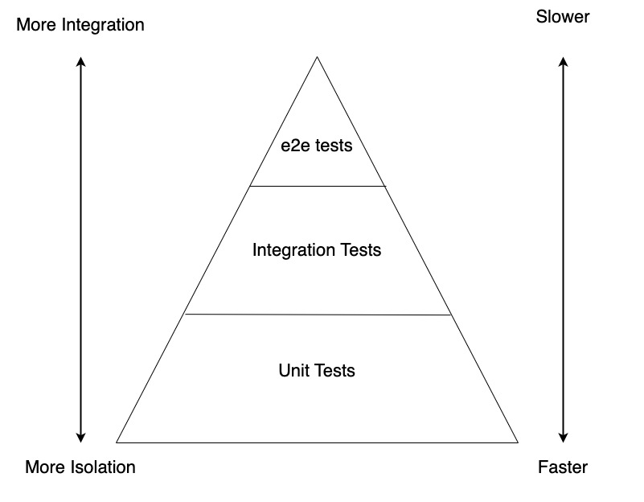
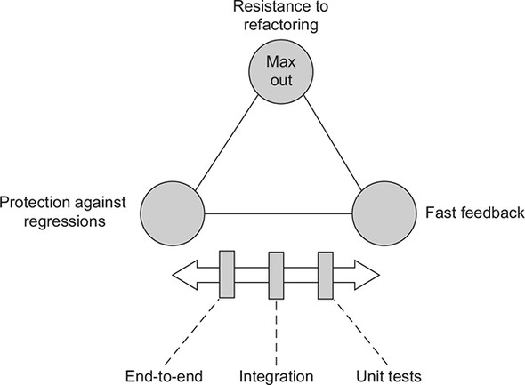
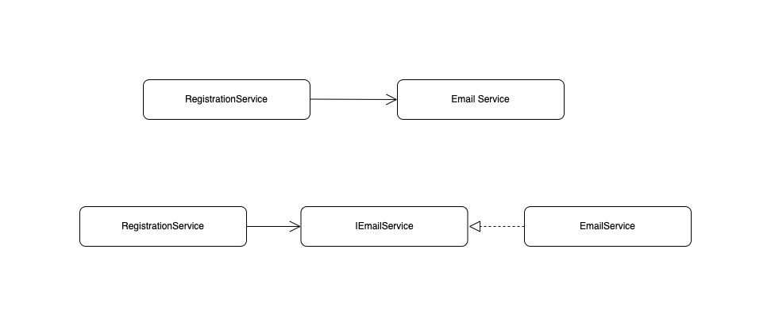

# Software Testing 101

<div class="pt-12">
  <span @click="$slidev.nav.next" class="px-2 py-1 rounded cursor-pointer bg-white bg-opacity-25">
    By Srinivas, Software Craftsperson @ EverestEngineering
  </span>
</div>

<style>
  h1 {
    color: white;
  }
</style>

<!--
The last comment block of each slide will be treated as slide notes. It will be visible and editable in Presenter Mode along with the slide. [Read more in the docs](https://sli.dev/guide/syntax.html#notes)
-->

---

# Agenda

We are going to cover

- **Why do we have to write automated tests ?**
- **Types of tests ( Test Pyramid )**
- **Are we really writing unit tests ?**
- **Writing testable code**
- **Types of test doubles**
- **Mocking best practices**
- **Integration testing**
- **e2e testing**


---

# Why do we have to write automated tests ?

<v-clicks>

- To see if the system satisfies the software requirements
  
- To catch regressions, if any
  
- To reduce/eliminate manual testing efforts
  
- To refactor without fear of breaking things
  
- To get good night sleep
  
- To help newcomers understand the codebase

</v-clicks>


---
layout: two-cols
---
# Types of tests

- Unit tests
- Integration tests
- e2e tests

::right::
<figure>
  
  <figcaption>Test Pyramid</figcaption>
</figure>

---
layout: two-cols
---
# The four pillers of a good test portfolio

<v-clicks>
  
  - Protection against regressions
  
  - Resistance to refactoring
  
  - Fast feedback
  
  - Maintainability

</v-clicks>

::right::
<v-click>
<figure>
  
</figure>
</v-click>

---

# What is unit test ?

<v-click>

#### A unit test is a piece of code

</v-click>
<v-clicks>

  - that verifies a small piece of code called the unit

  - and does that quickly

  - and does it in an isolated manner

</v-clicks>

<style>
  h4 {
    color: goldenrod;
    padding: 10px 0;
  }
  ul {
    padding: 0 10px;
  }
</style>

---

# Writing Testable code

<v-click>

```csharp {7-15|1-5|16-18|all}
class EmailService {
  public void sendEmail(string from, string to, string subject, string body){
    // sends email over network...
  }
}

class RegistrationService {

  public void register(string username, string email, string password){
    // logic to create user in database
    var emailService = new EmailService();
    emailService.sendEmail("team@website.com", email, "Welcome onboard", "We are happy to have you onboard")
  }
}

// in entry point
var registrationService = new RegistrationService();
registrationService.register("developer", "dummyemail@gmail.com", "hashedpassword");
```

</v-click>

---

# Writing Testable code (continued...)


<v-click>

> All problems in computer science can be solved by adding another level of indirection.
>
> -- <cite>David Wheeler</cite>

</v-click>

<v-click>

#### Dependency injection & Dependency Inversion

</v-click>

<v-click>

<figure>
  
  <figcaption>Dependency Inversion</figcaption>
</figure>

<style>
  h4 {
    padding: 10px 0;
  }
</style>

</v-click>

---

# Writing Testable code (continued...)


> All problems in computer science can be solved by adding another level of indirection.
>
> -- <cite>David Wheeler</cite>

<v-click>

```csharp {1-3|1-9}
interface IEmailService {
  void sendEmail(string from, string to, string subject, string body);
}

class EmailService: IEmailService {
  public function sendEmail(string from, string to, string subject, string body){
    // sends email over network...
  }
}
```

</v-click>

---

# Writing Testable code (continued...)

> All problems in computer science can be solved by adding another level of indirection.
>
> -- <cite>David Wheeler</cite>

```csharp {none|3-7|15-18|9-12|all}
class RegistrationService {

  private IEmailService _emailService;

  public RegistrationService(IEmailService emailService){
    this._emailService = emailService;
  }

  public void register(string username, string email, string password){
    // logic to create user in database
    _emailService.sendEmail("team@website.com", email, "Welcome onboard", "We are happy to have you onboard")
  }
}

// in entry point
IEmailService emailService = new EmailService();
var registrationService = new RegistrationService(emailService);
registrationService.register("developer", "dummyemail@gmail.com", "hashedpassword");
```

---

# Writing Testable code (continued...)

```csharp {none|1-11|13-17|all}
// TestRegistrationService.cs

class TestEmailService: IEmailService {

  public boolean EmailSent { get; private set; } = false;

  public function sendEmail(string from, string to, string subject, string body){
    // doesn't really send an email
    this.EmailSent = true;
  }
}

// in unit tests

// Arrange
IEmailService testEmailService = new TestEmailService();
var registrationService = new RegistrationService(testEmailService);

// Act
registrationService.register("developer", "dummyemail@gmail.com", "hashedpassword");

// Assert
Assert.True(testEmailService.EmailSent);

```


---

# Test Doubles
   - Mock
   - Spy
   - Stub
   - Dummy
   - Fake

---

# Example

```csharp
class Netflix {
  // ... member inititalizations

  public Netflix(User user, IMovieStore movieStore, 
                 IStreamingService streamingService, IScreenTracker screenTracker
  ) {
    this._user = user;
    this._streamingService = streamingService;
    this._movieStore = movieStore;
    this._screenTracker = screenTracker;
  }

  public void ListMovies(int offset, int limit){
    return _movieStore.list(offset, limit);
  }

  public void WatchMovie(Movie movie) {
    if(this._screenTracker.canWatch(_user.username)) {
      this._screenTracker.track(movie);
      this._streamingService.stream(movie);
    }
  }
}

```

---

# Test Watch Movie

```csharp
public void testWatchMovie(){
  var tester = new User("tester", "tester@gmail.com");
  var mockStreamingService = new Mock<IStreamingService>();
  var StubScreenTracker = new Mock<IScreenTracker>();
  StubScreenTracker.Setup(tracker => tracker.canWatch(tester.username))
      .Returns(true);
  var netflix = new Netflix(user, null, mockStreamingService.Object, StubScreenTracker.Object);
  var movie = new Movie("Pushpa", "http://link-to-video");

  netflix.WatchMovie(movie);

  mockStreamingService.Verify(SS => SS.stream(movie), Times.Exactly(1));
}
```

---

# Lets test Movie list

```csharp

public void testListMovies(){
  var tester = new User("tester", "tester@gmail.com");
  var fakeMovieStore = new FakeMovieStore();
  var dummyStreamingService = null;
  var dummyScreenTracker = new Mock<IScreenTracker>();
  var netflix = new Netflix(user, fakeMovieStore, dummyStreamingService, dummyScreenTracker);

  var movies = netflix.ListMovies(0, 2);

  var expected = DEFAULT_MOVIES;
  Assert.Equal(expected, movies);
}
```


---

# Fake Movie Store

```csharp
const DEFAULT_MOVIES = new List<Movie>() {
  new Movie(){"Bahubali", "https://link-to-video"},
  new Movie(){"RRR", "https://link-to-video"},
};

class FakeMovieStore : IMovieStore {
  private List<Movie> _movies = DEFAULT_MOVIES;

  public FakeMovieStore(){} // constructor

  public insert(Movie movie) => _movies.Add(movie);

  public list(int skip, int take) => _movies.Skip(skip).Take(take);
}
```


---

# Spy ( Hand written mocks)

```csharp {monaco}
// TestRegistrationService.cs
// Here TestEmailService is a spy
class TestEmailService: IEmailService {

  public boolean EmailSent { get; private set; } = false;

  public function sendEmail(string from, string to, string subject, string body){
    // doesn't really send an email
    this.EmailSent = true;
  }
}

// in unit tests

// Arrange
IEmailService testEmailService = new TestEmailService();
var registrationService = new RegistrationService(testEmailService);

// Act
registrationService.register("developer", "dummyemail@gmail.com", "hashedpassword");

// Assert
Assert.True(testEmailService.EmailSent);

```


---
layout: image-right
image: https://source.unsplash.com/collection/94734566/1920x1080
---

# Code

Use code snippets and get the highlighting directly![^1]

```ts{all|2|1-6|9}
interface User {
  id: number
  firstName: string
  lastName: string
  role: string
}

function updateUser(id: number, update: User) {
  const user = getUser(id)
  const newUser = {...user, ...update}  
  saveUser(id, newUser)
}
```

<arrow v-click="3" x1="400" y1="420" x2="230" y2="330" color="#564" width="3" arrowSize="1" />

---

# Further Reading


---

# Resources

- https://martinfowler.com/testing/
- https://www.softwaretestingmagazine.com/knowledge/unit-testing-fakes-mocks-and-stubs/
